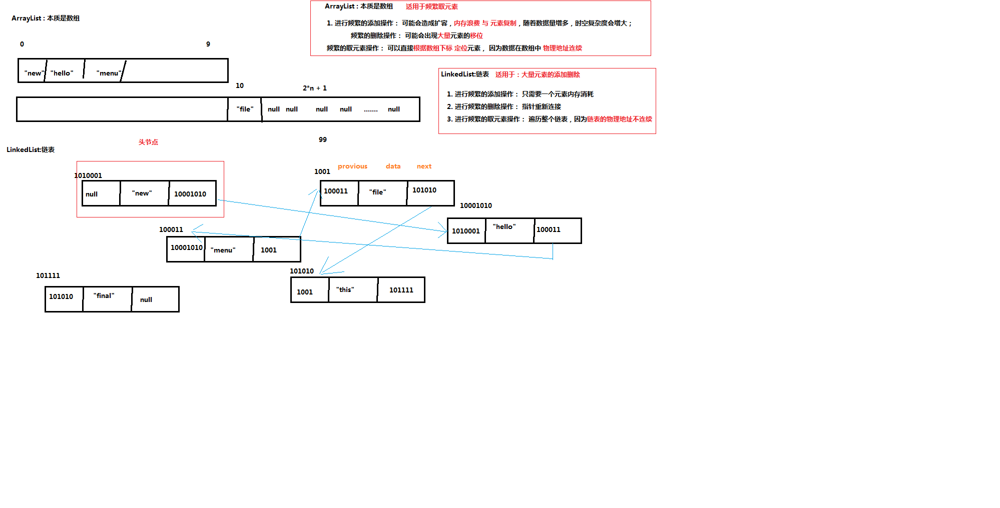

## List接口
​	

```java
常用实现子类：ArrayList<E>、 LinkedList<E>、 Vector<E>
```


## ArrayList与 LinkedList使用场合（区别）（重点，面试题常问）

* ArrayList本质是数组  （元素物理地址连续）
  * 频繁的添加操作：可能会造成扩容，内存浪费与大量元素复制移位，随着数据量增多，时空复杂度会增大；
  * 频繁的删除操作：可能会出现大量元素的移位
  * 频繁的取元素操作：能直接根据数组下标定位元素，因为数据在数组中的物理地址是连续的；
  * 【所以：ArrayList 适用于元素的随机访问】

* LinkedList 本质是链表（元素物理地址不连续）
  * 频繁的添加操作：只需要一个元素内存消耗
  * 频繁的删除操作：只需要元素指针重新连接
  * 频繁的取元素操作：需要遍历整个链表，因为链表的物理地址是不连续的
  * 【所以：LinkedList适用于元素的大量添加与删除】

  

### 集合的遍历
#### 1. 迭代器 Iterator<E>	
```java
  Iterator<E> it = list.iterator();
​	  注意：在Iterator 迭代器 进行遍历的时候，不允许出现元素位置发生改变，
​		   否则会出现快速迭代失败ConcurrentModificationException。

 Iterator<String> it = arrayList.iterator();
        while(it.hasNext()){
            String s = it.next();
            System.out.println("s :"+s);
        }

```


#### 2. foreach 	
```java
foreach 语法： 底层实现原理是 迭代器
	for(String s : list)｛
｝
```

### ### Vector<E>


```
从Java 2平台v1.2，这个类被改造为实现List接口
 	Vector是同步的,线程安全。
	所以Vector适用于多线程
	ArrayList适用于单线程。
```

